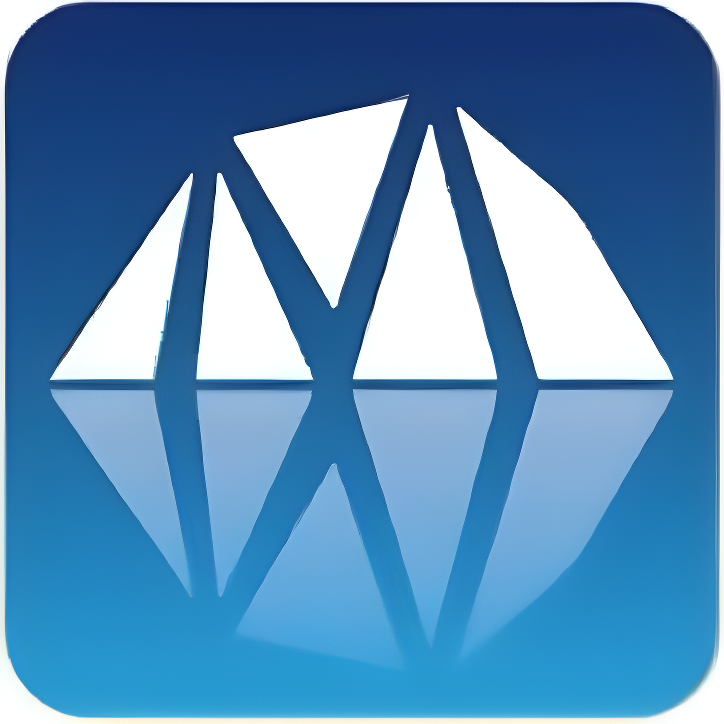

<div align="center">
  
  <h1>河北工业大学 RoboMaster 山海机甲战队</h1>
  <p><strong>保持热爱，共赴山海</strong></p>

  <p>
    <a href="https://space.bilibili.com/2055273988"></a>
    <a href="https://github.com/HebutMas"></a>
    
  </p>
</div>

---

## 📖 关于我们

河北工业大学 **RoboMaster 山海机甲战队** 是河北工业大学学生创新团队之一，由各专业热爱机器人技术的学生组建而成。战队成立于 2022 年，主要参加 **全国大学生机器人大赛 RoboMaster 机甲大师赛** 等赛事。

建队以来获得省国级奖项十余项，培养出了多名青年工程师和行业技术人才。

## 🌐 项目简介

本项目为山海机甲战队的**官方网站**，用于展示战队信息、成员介绍、开源项目、比赛赛程和战队图集等。网站采用纯静态前端技术构建，部署于 GitHub Pages。

### 🔗 在线访问

👉 [https://hebutmas.github.io/mas_web/](https://hebutmas.github.io/)

## 🏗️ 技术栈

| 类别 | 技术 |
|------|------|
| 前端框架 | 原生 HTML5 / CSS3 / JavaScript |
| 动画库 | [GSAP (GreenSock)](https://greensock.com/gsap/) |
| 图标 | 内联 SVG |
| 部署 | GitHub Pages |
| 字体 | 系统原生字体栈 |

## 📁 项目结构

```
web/
├── index.html          # 首页 — 团队介绍、关注我们、导航入口
├── members.html        # 战队成员 — 现任队员 & 往届队员信息
├── open_source.html    # 项目开源 — RoboMaster 论坛 + GitHub 仓库展示
├── photos.html         # 战队图集 — 图片画廊 + 灯箱浏览
├── schedule.html       # 比赛赛程 — 2026 赛程 & 往届战绩
├── contact.html        # 联系我们 — 地址、邮箱、社交链接 + 留言表单
├── style.css           # 全局样式表
├── nav.js              # 导航栏交互（响应式菜单）
├── script.js           # 全局脚本
├── members.js          # 战队成员数据 & 动态渲染
├── open_source.js      # GitHub 仓库 & 论坛数据动态加载
├── photos.js           # 图集数据 & 动态渲染
├── easter_egg.js       # 彩蛋脚本
└── source/             # 静态资源
    ├── logo/           # Logo 图片
    ├── banner/         # 首页横幅图片
    ├── icons/          # 社交图标 SVG
    ├── photos/         # 战队照片 & 成员头像
    └── partners/       # 合作伙伴 Logo
```

## 📄 页面功能

| 页面 | 功能描述 |
|------|----------|
| **首页** | 视频背景、团队介绍、社交媒体入口、三大模块导航（成员 / 图集 / 赛程） |
| **战队成员** | 现任队员与往届队员展示，JS 动态渲染成员卡片 |
| **项目开源** | 展示 RoboMaster 论坛开源帖 + GitHub 仓库列表，支持搜索过滤 |
| **战队图集** | 图片网格布局，点击查看大图灯箱效果 |
| **比赛赛程** | 2026 年赛事时间线 + 往届战绩回顾 |
| **联系我们** | 地址、邮箱、社交媒体 + 在线留言表单 |

## 🚀 本地开发

1. **克隆仓库**

```bash
git clone https://github.com/HebutMas/web.git
cd web
```

2. **启动本地服务器**

使用任意静态服务器即可，例如：

```bash
# Python 3
python -m http.server 8080

# Node.js (需要安装 http-server)
npx http-server . -p 8080

# VS Code Live Server 插件
# 右键 index.html → Open with Live Server
```

3. **打开浏览器访问** `http://localhost:8080`

## 📦 部署

本项目设计为开箱即用的静态站点，推送到 GitHub Pages 分支即可自动部署：

- **GitHub Pages**：将代码推送至 `main` 或 `gh-pages` 分支，在仓库 Settings → Pages 中配置即可
- 也可部署到 **Netlify**、**Vercel** 等静态托管平台，无需额外配置

## 🤝 合作伙伴

特别感谢以下合作伙伴对山海机甲战队的大力支持（排名不分先后）：

<p align="center">
  <a href="https://bambulab.com/zh"></a>
  <a href="https://www.cuav.net/"></a>
  <a href="https://www.china-amass.com/"></a>
</p>

## 📬 联系我们

- **地址**：天津市北辰区西平道 5340 号 河北工业大学
- **邮箱**：[sji733055@gmail.com](mailto:sji733055@gmail.com)
- **Bilibili**：[山海机甲官方频道](https://space.bilibili.com/2055273988)
- **GitHub**：[HebutMas](https://github.com/HebutMas)
- **微信公众号**：山海机甲

---

<div align="center">
  <p>© 2026 河北工业大学 RoboMaster 山海机甲战队. All Rights Reserved.</p>
</div>
